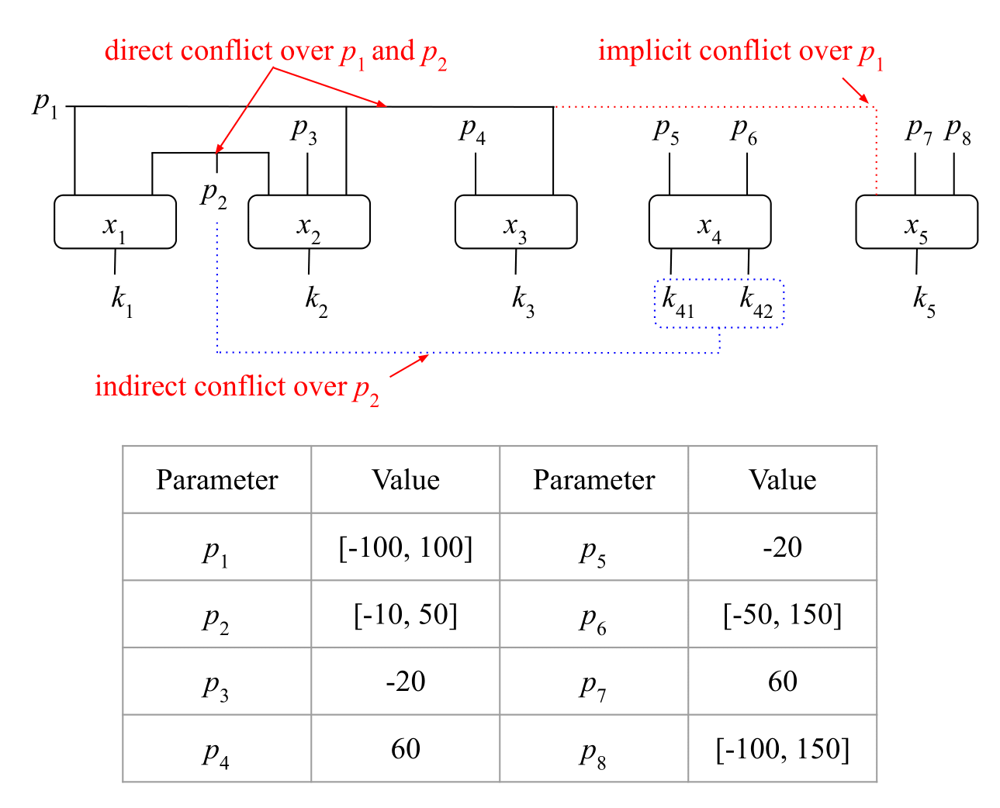

# QACM

- We utilized the Gaussian distribution function to generate KPIs for xApps, based on their respective Input Control Parameters (ICPs). 
The resulting dataset was then employed to train the prediction component of each intelligent xApp, enabling it to predict KPIs based on the ICPs. 
To model the xApps, we employed the ANN and polynomial regression block, with X representing the input and y representing the output. 
Regardless of the training dataset used, both X and y should follow these structures:

- X structure: [[p11, p21], [p12, p22], [p13, p23], ....]
- y structure: [y1, y2, y3]

- Each xApp in the used experimental model looks like -

            p1 ------>  |...........|
                        |  xApp_1   |-------> k_1
            p2 ------>  |...........|

- Here, p1 (input1) and p2 (input2) are the ICPs and k_1 (output) is the KPI for xApp_1. This KPIs are then converted to utility using a z-score normalisation technique presented in the paper.

- In the csv files in this repository, data is organised as- ICPs, KPIs, normalised_KPIs, normalised_QoS_Threshold. The following explains how the 
gaussian normal distribution is used to generate these data for each xApp. 

#### Experimental Model:

- The above gives a general overview of how dataset are organised in the csv files. Five xApps with eight ICPs and six KPIs are used in the experimental model as shown below: 

- Each of the six KPIs are generated using the following six gaussian distribution formulas. 
$k_1 = 80 \times e^{-\frac{(p_1 + 0)^2}{2p_2^2}}$, $k_2 = 100 \times e^{-\frac{(p_1 + p_3)^2}{2p_2^2}}$, $k_3 = 120 \times e^{-\frac{(p_1 + 45)^2}{2p_4^2}}$, $k_{41} = 120 \times e^{-\frac{(p_6 + (p_2 -30))^2}{2p_5^2}}$, $k_{42} = 150 \times e^{-\frac{(p_6 + (p_2 -50))^2}{2p_5^2}}$, and $k_5 = -35 \times e^{-\frac{(p_8 + (p_1 -25))^2}{2p_7^2}}$

- Values for $p_1$ to $p_8$ in equations are used from the table illustrated above in the figure. 
